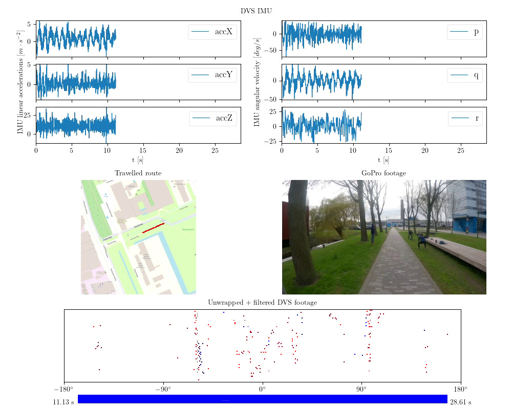

# NavDataset - A novel multi-vision sensor dataset for insect-inspired outdoor autonomous navigation

Jan Verheyen, Julien Dupeyroux, and Guido de Croon.  *Micro Air Vehicle Lab, Faculty of Aerospace Engineering,  Delft  University  of  Technology,  The  Netherlands.*

**Abstract** - Insects have --- over millions of years of evolution --- perfected many of the systems that roboticists aim to achieve in Micro Air Vehicles (MAVs); they can swiftly and robustly navigate through different environments under various conditions while at the same time being highly energy efficient. To reach this level of performance and efficiency one might want to look at and take inspiration from how these insects achieve their feats. Currently, no dataset exists that allows such models to be evaluated over long real-life routes. We present a dataset containing omnidirectional event vision, frame-based vision, depth frames, inertial measurement (IMU) readings, and centimeter-accurate GNSS positioning over kilometer long stretches in and around the TUDelft campus. The dataset is used to evaluate familiarity-based insect-inspired neural navigation models on their performance over longer sequences. It demonstrates that current scene familiarity models are not suited for long-ranged navigation, at least not in their current form.

---

The full dataset is available at:  https://data.4tu.nl/articles/dataset/. _The dataset will be made available upon publication._

---

Link to the supporting data paper:  https://link/to/the/datapaper. _The paper will be made available upon publication._

---

*This project has received funding from the ECSEL Joint Undertaking (JU) under grant agreement No. 826610. The JU receives support from the European Union's Horizon 2020 research and innovation program and Spain, Austria, Belgium, Czech Republic, France, Italy, Latvia and Netherlands.*

---

## 1. The dataset

### 1.1. The acquisition setup

The dataset was collected on an Intel Up board running Ubuntu 16.04 with ROS Kinetic. An overview of the sensors in/on the dataset box can be seen below.

|Sensor                    | Characteristics                | Container|
|------------------------- | :---------------                | :---------|
|DAVIS240                  | 240 x 180 pixel DVS            | bag/HDF5|
|                          | AER                            |
|GoPro Hero 8 Black        | 1920 x 1080 pixel              | mp4 (HEVC)|
|                          | 60 Hz                          |
|Ublox ZED-F9P GNSS module | NavPVT[^1]                         | bag/HDF5|
|                          |5 Hz                            |
|                          | Position accuracy 1.3 cm CEP   |
|Intel Realsense d435i     | 720 x 1280 pixel depth         |  bag     |
|                          | 30 Hz                          |
|                          | 16UC1                          |

[^1]: <https://docs.ros.org/en/kinetic/api/ublox_msgs/html/msg/NavPVT.html>

### 1.2. Availability

The dataset consists of in total 12 runs. 6 runs going away from the 'home' position, and 6 runs - along the same route - in the opposite direction. For each run we provide the the data both in **ROS bags** and **HDF5** containers (DVS, IMU, and GPS). Depth stream only in **ROS bag** format. Video is provided in **HEVC** encoded **.MP4** containers. For an overview see the table above.

## 2. How to use the dataset

The `scripts/dutchnavdataset` provides a Python 3 package for handling the dataset's files.

### 2.1 Usage requirements

- ROS noetic (needed for rosbag, rospy, ...) <https://wiki.ros.org/noetic/Installation>
- dvs ROS driver (needed for dvs_msgs) The installation process is explained in details for ROS Noetic (Ubuntu 20.04) <https://github.com/uzh-rpg/rpg_dvs_ros>.
- required python packages - `$ pip install -r scripts/requirements.txt`

### 2.2 Installation (optional)

1. clone this repo: `$ git clone https://github.com/tudelft/NavDataset`
2. go to 'scripts' `$ cd scripts`
3. install the package `$ python setup.py install`

### 2.3 Usage

- `scripts/dutchnavdataset/tools`
  - `process_bag_files.py` provides a suite of functions to read the various `.bag` files
  - `dataset_packager` provides a class to package the .bag files in to a single hdf5 container
  - `data_visualizer` provides a class and functions to visualize (parts) of the dataset
  - `data_loader` provides 2 classes to load and process (mask, unwrap, noise filter) the hdf5 containers
- `scripts/demos`
  - `process_dataset.py` is a script to convert, per route, the .bag files to a single .h5 container
  - `visualize_track.py` visualizes a part of the track, including all its sensors. See example below.

Side references for hardware / software integration:

https://www.epncb.oma.be/_organisation/WG/previous/euref_IP/index.php 
https://github.com/nunojpg/ntripserver 
https://github.com/uzh-rpg/rpg_dvs_ros/tree/master/dvs_msgs/msg 
https://wiki.ros.org/Bags 
https://www.hdfgroup.org/solutions/hdf5 
